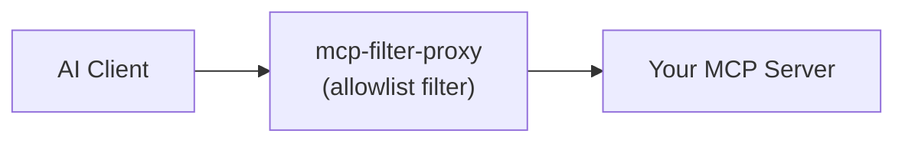

# mcp-filter-proxy

A generic MCP proxy that wraps any MCP server and supports filtering which tools are exposed to clients and what protocol to use to expose that MCP server.

Supports all transport types (stdio, SSE, HTTP) and can bridge between them. For example, wrapping a stdio server and exposing it over HTTP.

## How it works



The proxy sits between your AI client and an MCP server. Anything not on its allowlist is hidden: it never appears in the listing the LLM sees and any direct call to it is rejected, so the LLM is never aware it exists. The same allowlist mechanism applies to tools, resources, and prompts, each with its own env var. Leave an allowlist unset to forward that kind unfiltered.

The wrapped server command and its arguments are passed as positional arguments, everything after `mcp-filter-proxy` is forwarded as-is to the command you want to run. All proxy-specific environment variables are stripped before forwarding, so your proxy config never leaks into the wrapped server.

## Connection Modes

The upstream MCP server is reached using one of three transports, selected with `MCP_FILTER_PROXY_UPSTREAM_TRANSPORT`.

| Mode | When it activates                                                          | How it connects |
| --- |----------------------------------------------------------------------------| --- |
| **stdio** | `stdio`                                | Spawns the wrapped command as a child process and talks over stdio |
| **SSE** | `sse` + `MCP_FILTER_PROXY_SERVER_URL`  | Connects over Server-Sent Events (for older servers not yet on Streamable HTTP) |
| **HTTP** | `http` + `MCP_FILTER_PROXY_SERVER_URL` | Connects over Streamable HTTP |

## Using with AI Tools

### Any MCP-Compatible Tool

Tools such as Claude Desktop, Cursor, and Windsurf use a JSON config file. Add an entry under `mcpServers`.

To filter a local stdio server (the most common case), pass the wrapped command as CLI args. The proxy spawns it as a child process and communicates over stdio:

```json5
{
  "mcpServers": {
    "filtered-filesystem": {
      "command": "npx",
      "args": [
        "-y", "mcp-filter-proxy",
        "npx", "-y", "another-mcp-server"
      ],
      "env": {
        "MCP_FILTER_PROXY_UPSTREAM_TRANSPORT": "stdio",
        "MCP_FILTER_PROXY_ALLOWED_TOOLS": "read_file,list_directory,search_files"
      }
    }
  }
}
```

To wrap a remote server over Streamable HTTP, point at its URL instead. The proxy re-exposes it as a stdio server to your client:

```json5
{
  "mcpServers": {
    "filtered-http-server": {
      "command": "npx",
      "args": ["-y", "mcp-filter-proxy"],
      "env": {
        "MCP_FILTER_PROXY_UPSTREAM_TRANSPORT": "http",
        "MCP_FILTER_PROXY_SERVER_URL": "http://my-server:3001/mcp",
        "MCP_FILTER_PROXY_ALLOWED_TOOLS": "run_query,list_schemas"
      }
    }
  }
}
```

Leave `MCP_FILTER_PROXY_ALLOWED_TOOLS` out entirely to allow all tools (useful when you only want the transport-bridging feature).

### Claude Code

Use `claude mcp add` to register the server. The proxy config goes in `--env` flags, and the wrapped command comes after `--`:

```bash
claude mcp add --transport stdio filtered-filesystem \
  --env MCP_FILTER_PROXY_UPSTREAM_TRANSPORT=stdio \
  --env MCP_FILTER_PROXY_ALLOWED_TOOLS=read_file,list_directory \
  -- npx -y mcp-filter-proxy npx -y another-mcp-server
```

**Hint:** You can include `--scope project` to add the server only to the current project.

## Environment Variables

All configuration is via environment variables.

### Required

| Variable | Description |
| --- | --- |
| `MCP_FILTER_PROXY_UPSTREAM_TRANSPORT` | Upstream transport: `stdio`, `sse`, or `http` |

### Optional

| Variable | Default | Description |
| --- | --- | --- |
| `MCP_FILTER_PROXY_SERVER_URL` | — | URL of the upstream MCP server (e.g. `http://localhost:3001/mcp`). Required when the upstream transport is `sse` or `http` |
| `MCP_FILTER_PROXY_ALLOWED_TOOLS` | *(allow all)* | Comma-separated list of allowed tool names. Omit or leave empty to allow everything |
| `MCP_FILTER_PROXY_ALLOWED_RESOURCES` | *(allow all)* | Comma-separated list of allowed resource **names**. Disallowed resources are hidden from listings and `resources/read` of one is rejected |
| `MCP_FILTER_PROXY_ALLOWED_PROMPTS` | *(allow all)* | Comma-separated list of allowed prompt names. Disallowed prompts are hidden from listings and `prompts/get` of one is rejected |
| `MCP_FILTER_PROXY_EXPOSE_TRANSPORT` | `stdio` | How to expose the proxy to clients: `stdio` or `http` |
| `MCP_FILTER_PROXY_EXPOSE_PORT` | `8808` | Port for the HTTP expose server |
| `MCP_FILTER_PROXY_EXPOSE_HOST` | `127.0.0.1` | Bind address for the HTTP expose server |

### Upstream authentication (sse/http)

| Variable | Default | Description |
| --- | --- | --- |
| `MCP_FILTER_PROXY_UPSTREAM_AUTH` | `auto` | `auto` performs an interactive browser OAuth flow when the upstream replies `401`; `none` disables it |
| `MCP_FILTER_PROXY_AUTH_TOKEN` | — | Pre-obtained credential sent as `Authorization: <scheme> <token>`. Takes precedence over OAuth (good for CI/headless). The value is sent verbatim after the scheme |
| `MCP_FILTER_PROXY_AUTH_SCHEME` | `bearer` | Scheme for `MCP_FILTER_PROXY_AUTH_TOKEN`: `bearer` or `basic`. For `basic`, the token must be the base64 of `username:password` (e.g. `printf 'user:pass' \| base64`) |
| `MCP_FILTER_PROXY_OAUTH_CALLBACK_PORT` | `8661` | Loopback port the OAuth redirect callback listens on |
| `MCP_FILTER_PROXY_OAUTH_SCOPE` | — | OAuth scope to request. Omit to let the server decide |
| `MCP_FILTER_PROXY_OAUTH_CLIENT_NAME` | `MCP Filter Proxy` | `client_name` advertised during dynamic client registration |
| `MCP_FILTER_PROXY_OAUTH_STORE_DIR` | `~/.mcp-auth/mcp-filter-proxy-<version>/oauth` | Directory where OAuth tokens and registration are cached |

## Authenticating to OAuth-protected upstreams

The proxy also supports interactive browser-based OAuth flows that some remote MCP servers require (for example the Atlassian MCP server). 

The first run opens a browser for you to authorize. Tokens are cached under `~/.mcp-auth/mcp-filter-proxy-<version>/oauth` (keyed per server URL, and versioned so an upgrade starts clean) and refreshed automatically on later runs, so you are not prompted again. To force re-authentication, delete that directory.

If you already hold a token (or run headless), set `MCP_FILTER_PROXY_AUTH_TOKEN` to skip the browser entirely, or set `MCP_FILTER_PROXY_UPSTREAM_AUTH=none` to disable upstream auth.

## Finding tool names

To see which tools a server exposes, ask your AI assistant to list them, or use the MCP Inspector:

```bash
npx @modelcontextprotocol/inspector npx -y another-mcp-server /home/user
```

Open the **Tools** tab, then copy the names you want into `MCP_FILTER_PROXY_ALLOWED_TOOLS`.

## Development

```bash
git clone https://github.com/SecretX33/mcp-filter-proxy.git
cd mcp-filter-proxy
npm install
npm run build
```

The compiled server is written to `dist/index.js`. Run in watch mode during development:

```bash
npm run dev
```

Run the test suite with `npm test`.

## License

MIT
