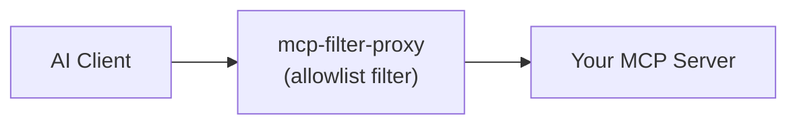

# mcp-filter-proxy

A generic MCP proxy that wraps any MCP server and supports filtering which tools are exposed to clients and what protocol to use to expose that MCP server.

Supports all transport types (stdio, SSE, HTTP) and can bridge between them. For example, wrapping a stdio server and exposing it over HTTP.

## How it works



The proxy sits between your AI client and an MCP server. Anything not on its allowlist is hidden: it never appears in the listing the LLM sees and any direct call to it is rejected, so the LLM is never aware it exists. The same allowlist mechanism applies to tools, resources, and prompts, each with its own env var. Leave an allowlist unset to forward that kind unfiltered.

The proxy is otherwise transparent: it advertises full client capabilities to the wrapped server and relays server-initiated requests through to your real client.

## Connection Modes

The upstream MCP server is reached using one of three transports. You can set
`MCP_FILTER_PROXY_UPSTREAM_TRANSPORT` explicitly, or leave it unset and let the proxy autodetect. 

| Mode | When it activates                                                          | How it connects |
| --- |----------------------------------------------------------------------------| --- |
| **stdio** | `stdio`, or a command (not a URL) as the first positional argument | Spawns the wrapped command as a child process and talks over stdio |
| **SSE** | `sse`, or autodetected when the URL path ends in `/sse` | Connects over Server-Sent Events (for older servers not yet on Streamable HTTP) |
| **HTTP** | `http`, or autodetected when the first positional argument is an http(s) URL without an `/sse` path | Connects over Streamable HTTP |

## Using with AI Tools

### Any MCP-Compatible Tool

Tools such as Claude Desktop, Cursor, and Windsurf use a JSON config file. Add an entry under `mcpServers`.

To filter a local stdio server (the most common case), pass the wrapped command as CLI args. The proxy spawns it as a child process and communicates over stdio:

```json5
{
  "mcpServers": {
    "filtered-filesystem": {
      "command": "npx",
      "args": [
        "-y", "mcp-filter-proxy",
        "npx", "-y", "another-mcp-server"
      ],
      "env": {
        "MCP_FILTER_PROXY_ALLOWED_TOOLS": "read_file,list_directory,search_files"
      }
    }
  }
}
```

To wrap a remote server over Streamable HTTP, pass its URL as the first argument (any positional argument that parses as an http(s) URL is treated as the upstream server). The proxy re-exposes it as a stdio server to your client:

```json5
{
  "mcpServers": {
    "filtered-http-server": {
      "command": "npx",
      "args": ["-y", "mcp-filter-proxy", "http://my-server:3001/mcp"],
      "env": {
        "MCP_FILTER_PROXY_ALLOWED_TOOLS": "run_query,list_schemas"
      }
    }
  }
}
```

Leave `MCP_FILTER_PROXY_ALLOWED_TOOLS`/`MCP_FILTER_PROXY_DENIED_TOOLS` out entirely to allow all tools (useful when you only want the transport-bridging feature).

### Claude Code

Use `claude mcp add` to register the server. The proxy config goes in `--env` flags, and the wrapped command comes after `--`:

```bash
claude mcp add --transport stdio filtered-filesystem \
  --env MCP_FILTER_PROXY_ALLOWED_TOOLS=read_file,list_directory \
  -- npx -y mcp-filter-proxy npx -y another-mcp-server
```

**Hint:** You can include `--scope project` to add the server only to the current project.

## Environment Variables

All configuration is via environment variables.

### Required

There is no single required variable, but you must give the proxy something to connect to as positional arguments: either a command to spawn (for a stdio upstream) or an http(s) URL (for a remote upstream). The transport is then autodetected unless you set `MCP_FILTER_PROXY_UPSTREAM_TRANSPORT`.

### Optional

| Variable | Default | Description |
| --- | --- | --- |
| `MCP_FILTER_PROXY_UPSTREAM_TRANSPORT` | *(auto)* | Upstream transport: `stdio`, `sse`, or `http`. Leave unset to autodetect: a URL argument connects over Streamable HTTP, or SSE when its path ends in `/sse`, with fallback to the other variant; otherwise `stdio`. Set it to force a specific transport with no fallback |
| `MCP_FILTER_PROXY_HEADERS` | `{}` | Extra headers to send to an http/sse upstream, as a JSON object (e.g. `{"X-Api-Key":"${MY_KEY}"}`). Values may reference env vars via `${VAR}`, expanded at startup |
| `MCP_FILTER_PROXY_ALLOWED_TOOLS` | *(all)* | Comma-separated list of tool-name [globs](#filtering-with-globs) to expose. Omit to allow everything |
| `MCP_FILTER_PROXY_DENIED_TOOLS` | *(none)* | Comma-separated list of tool-name globs to hide. Everything else is exposed |
| `MCP_FILTER_PROXY_ALLOWED_RESOURCES` | *(all)* | Comma-separated list of resource-**name** globs to expose. Disallowed resources are hidden from listings and `resources/read` of one is rejected. This also governs MCP-UI app/widget resources (e.g. Atlassian's Jira/Confluence widgets), which are exposed as ordinary resources |
| `MCP_FILTER_PROXY_DENIED_RESOURCES` | *(none)* | Comma-separated list of resource-name globs to hide. Everything else is exposed |
| `MCP_FILTER_PROXY_ALLOWED_PROMPTS` | *(all)* | Comma-separated list of prompt-name globs to expose. Disallowed prompts are hidden from listings and `prompts/get` of one is rejected |
| `MCP_FILTER_PROXY_DENIED_PROMPTS` | *(none)* | Comma-separated list of prompt-name globs to hide. Everything else is exposed |
| `MCP_FILTER_PROXY_EXPOSE_TRANSPORT` | `stdio` | How to expose the proxy to clients: `stdio` or `http` |
| `MCP_FILTER_PROXY_EXPOSE_PORT` | `8808` | Port for the HTTP expose server |
| `MCP_FILTER_PROXY_EXPOSE_HOST` | `127.0.0.1` | Bind address for the HTTP expose server |

### Upstream authentication (SSE/HTTP)

| Variable | Default | Description |
| --- | --- | --- |
| `MCP_FILTER_PROXY_UPSTREAM_AUTH` | `auto` | `auto` performs an interactive browser OAuth flow when the upstream replies `401`; `none` disables it |
| `MCP_FILTER_PROXY_AUTH_TOKEN` | — | Pre-obtained credential sent as `Authorization: <scheme> <token>`. Takes precedence over OAuth (good for CI/headless). The value is sent verbatim after the scheme |
| `MCP_FILTER_PROXY_AUTH_SCHEME` | `bearer` | Scheme for `MCP_FILTER_PROXY_AUTH_TOKEN`: `bearer` or `basic`. For `basic`, the token must be the base64 of `username:password` (e.g. `printf 'user:pass' \| base64`) |
| `MCP_FILTER_PROXY_OAUTH_CALLBACK_PORT` | `8661` | Loopback port the OAuth redirect callback listens on. Left at the default, a busy port is skipped for the next free one (so concurrent first-time sign-ins don't collide); set it explicitly to pin a single port |
| `MCP_FILTER_PROXY_OAUTH_SCOPE` | `openid email profile` | OAuth scope to request. Scopes the server advertises (via `WWW-Authenticate` or protected-resource metadata) take precedence; this is the fallback when it advertises none. Some servers (e.g. Atlassian) only return resources/prompts to a scoped token, so the default is non-empty |
| `MCP_FILTER_PROXY_OAUTH_RESOURCE` | — | RFC 8707 `resource` (audience) to bind the token to. Omit to send none unless the server's protected-resource metadata supplies one. Useful for audience-bound tokens or multi-tenant servers |
| `MCP_FILTER_PROXY_OAUTH_CLIENT_NAME` | `MCP Filter Proxy` | `client_name` advertised during dynamic client registration |
| `MCP_FILTER_PROXY_OAUTH_STORE_DIR` | `~/.mcp-auth/mcp-filter-proxy-<version>/oauth` | Directory where OAuth tokens and registration are cached |

## Filtering with globs

Each kind (tools, resources, prompts) can be filtered with **either** an allowlist (`ALLOWED_*`, expose only matches) **or** a denylist (`DENIED_*`, expose everything except matches).

| Pattern | Matches |
| --- | --- |
| `read_file` | exactly `read_file` |
| `read_*` | names starting with `read_` |
| `*_file` | names ending with `_file` |
| `*search*` | names containing `search` |
| `[Rr]ead_file` | either `read_file` or `Read_file` (a `[...]` set matches one character from it) |

Matching is case-sensitive, so a `[...]` character class is the way to accept more than one casing of a letter.

## Authenticating to OAuth-protected upstreams

The proxy also supports interactive browser-based OAuth flows that some remote MCP servers require (for example the Atlassian MCP server). 

The first run opens a browser for you to authorize. Tokens are cached under `~/.mcp-auth/mcp-filter-proxy-<version>/oauth` (keyed per server URL, and versioned so an upgrade starts clean) and refreshed automatically on later runs, so you are not prompted again. To force re-authentication, delete that directory.

If you already hold a token (or run headless), set `MCP_FILTER_PROXY_AUTH_TOKEN` to skip the browser entirely, or set `MCP_FILTER_PROXY_UPSTREAM_AUTH=none` to disable upstream auth.

## Finding tool names

To see which tools a server exposes, ask your AI assistant to list them, or use the MCP Inspector:

```bash
npx @modelcontextprotocol/inspector npx -y another-mcp-server
```

Open the **Tools** tab, then copy the names you want into `MCP_FILTER_PROXY_ALLOWED_TOOLS`.

## Development

```bash
git clone https://github.com/SecretX33/mcp-filter-proxy.git
cd mcp-filter-proxy
pnpm install
pnpm build
```

The compiled server is written to `dist/index.js`. Run in watch mode during development:

```bash
pnpm dev
```

Run the test suite with `pnpm test`.

## License

MIT
