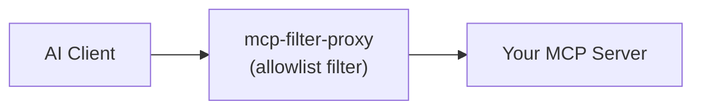

# mcp-filter-proxy

A generic MCP proxy that wraps any MCP server and supports filtering which tools are exposed to clients and what protocol to use to expose that MCP server.

Supports all transport types (stdio, SSE, HTTP) and can bridge between them. For example, wrapping a stdio server and exposing it over HTTP.

## How it works



The proxy sits between your AI client and an MCP server. Any tool not on the allowlist is hidden: it never appears in the server's tool list and calls to it are rejected, so the LLM is never aware it exists. Resources and prompts are forwarded unfiltered.

The wrapped server command and its arguments are passed as positional arguments, everything after `mcp-filter-proxy` is forwarded as-is to the command you want to run. All proxy-specific environment variables are stripped before forwarding, so your proxy config never leaks into the wrapped server.

## Connection Modes

The upstream MCP server is reached using one of three transports, selected with `MCP_FILTER_PROXY_UPSTREAM_TRANSPORT`.

| Mode | When it activates                                                          | How it connects |
| --- |----------------------------------------------------------------------------| --- |
| **stdio** | `stdio`                                | Spawns the wrapped command as a child process and talks over stdio |
| **SSE** | `sse` + `MCP_FILTER_PROXY_SERVER_URL`  | Connects over Server-Sent Events (for older servers not yet on Streamable HTTP) |
| **HTTP** | `http` + `MCP_FILTER_PROXY_SERVER_URL` | Connects over Streamable HTTP |

## Using with AI Tools

### Any MCP-Compatible Tool

Tools such as Claude Desktop, Cursor, and Windsurf use a JSON config file. Add an entry under `mcpServers`.

To filter a local stdio server (the most common case), pass the wrapped command as CLI args. The proxy spawns it as a child process and communicates over stdio:

```json5
{
  "mcpServers": {
    "filtered-filesystem": {
      "command": "npx",
      "args": [
        "-y", "mcp-filter-proxy",
        "npx", "-y", "another-mcp-server"
      ],
      "env": {
        "MCP_FILTER_PROXY_UPSTREAM_TRANSPORT": "stdio",
        "MCP_FILTER_PROXY_ALLOWED_TOOLS": "read_file,list_directory,search_files"
      }
    }
  }
}
```

To wrap a remote server over Streamable HTTP, point at its URL instead. The proxy re-exposes it as a stdio server to your client:

```json5
{
  "mcpServers": {
    "filtered-http-server": {
      "command": "npx",
      "args": ["-y", "mcp-filter-proxy"],
      "env": {
        "MCP_FILTER_PROXY_UPSTREAM_TRANSPORT": "http",
        "MCP_FILTER_PROXY_SERVER_URL": "http://my-server:3001/mcp",
        "MCP_FILTER_PROXY_ALLOWED_TOOLS": "run_query,list_schemas"
      }
    }
  }
}
```

Leave `MCP_FILTER_PROXY_ALLOWED_TOOLS` out entirely to allow all tools (useful when you only want the transport-bridging feature).

### Claude Code

Use `claude mcp add` to register the server. The proxy config goes in `--env` flags, and the wrapped command comes after `--`:

```bash
claude mcp add --transport stdio filtered-filesystem \
  --env MCP_FILTER_PROXY_UPSTREAM_TRANSPORT=stdio \
  --env MCP_FILTER_PROXY_ALLOWED_TOOLS=read_file,list_directory \
  -- npx -y mcp-filter-proxy npx -y another-mcp-server
```

**Hint:** You can include `--scope project` to add the server only to the current project.

## Environment Variables

All configuration is via environment variables.

### Required

| Variable | Description |
| --- | --- |
| `MCP_FILTER_PROXY_UPSTREAM_TRANSPORT` | Upstream transport: `stdio`, `sse`, or `http` |

### Optional

| Variable | Default | Description |
| --- | --- | --- |
| `MCP_FILTER_PROXY_SERVER_URL` | — | URL of the upstream MCP server (e.g. `http://localhost:3001/mcp`). Required when the upstream transport is `sse` or `http` |
| `MCP_FILTER_PROXY_ALLOWED_TOOLS` | *(allow all)* | Comma-separated list of allowed tool names. Omit or leave empty to allow everything |
| `MCP_FILTER_PROXY_EXPOSE_TRANSPORT` | `stdio` | How to expose the proxy to clients: `stdio` or `http` |
| `MCP_FILTER_PROXY_EXPOSE_PORT` | `8808` | Port for the HTTP expose server |
| `MCP_FILTER_PROXY_EXPOSE_HOST` | `127.0.0.1` | Bind address for the HTTP expose server |

## Finding tool names

To see which tools a server exposes, ask your AI assistant to list them, or use the MCP Inspector:

```bash
npx @modelcontextprotocol/inspector npx -y another-mcp-server /home/user
```

Open the **Tools** tab, then copy the names you want into `MCP_FILTER_PROXY_ALLOWED_TOOLS`.

## Development

```bash
git clone https://github.com/SecretX33/mcp-filter-proxy.git
cd mcp-filter-proxy
npm install
npm run build
```

The compiled server is written to `dist/index.js`. Run in watch mode during development:

```bash
npm run dev
```

Run the test suite with `npm test`.

## License

MIT
